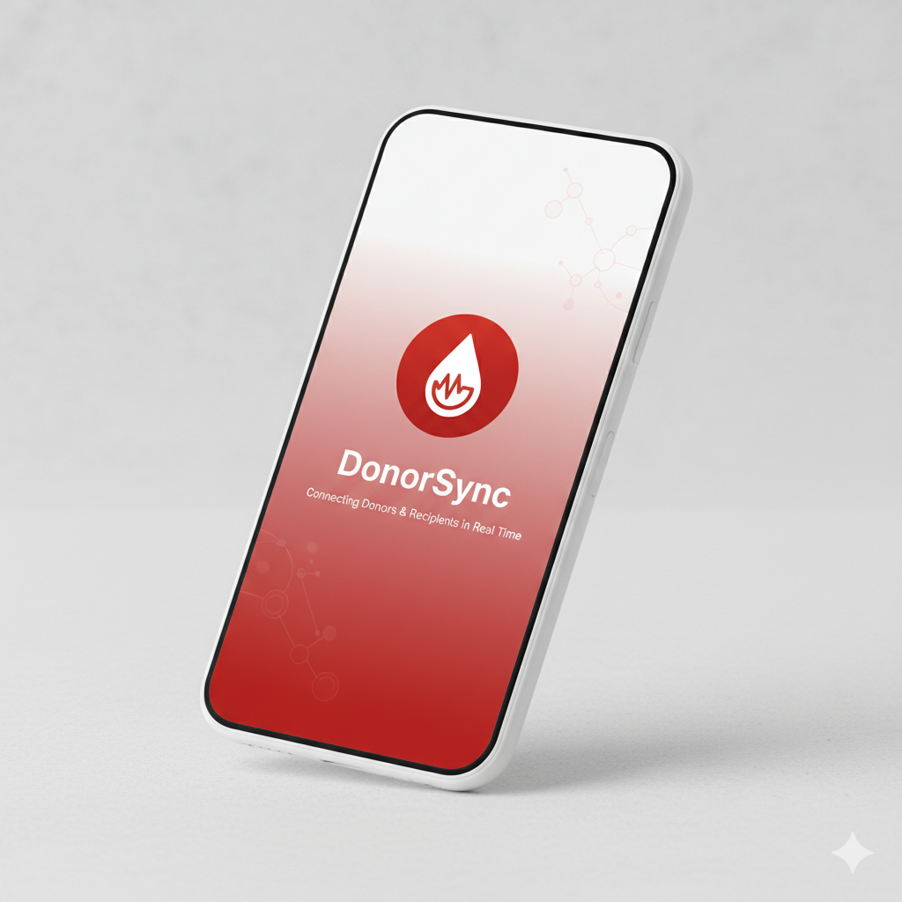
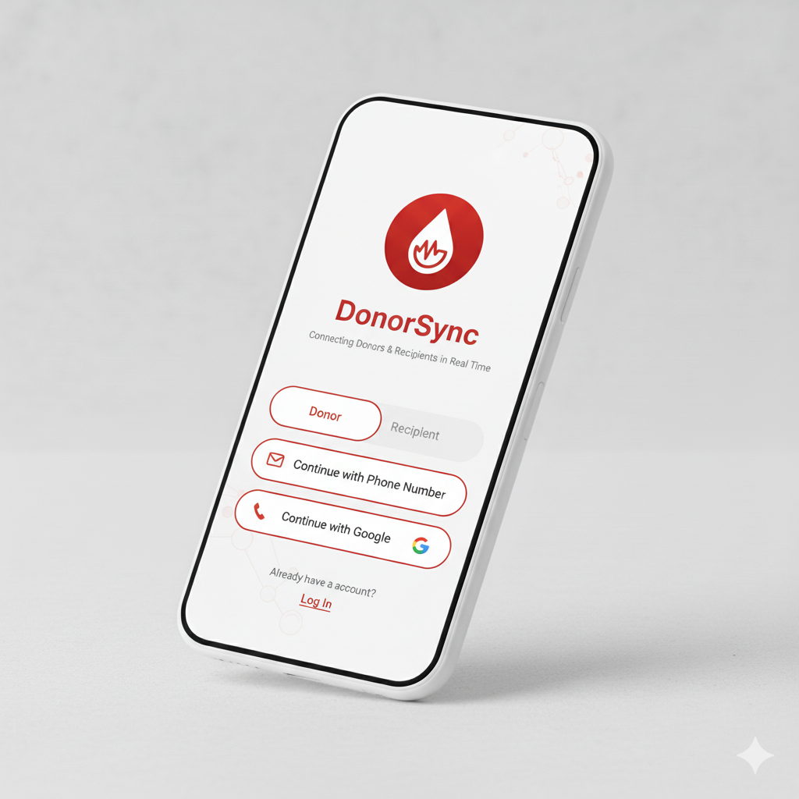
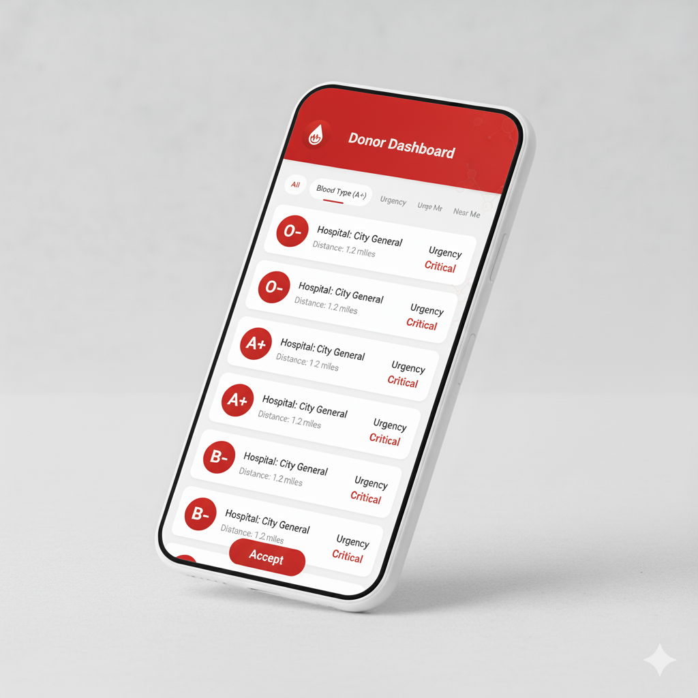
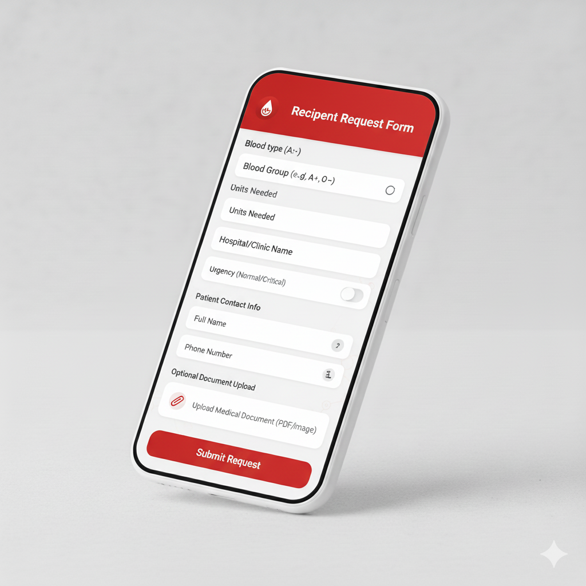
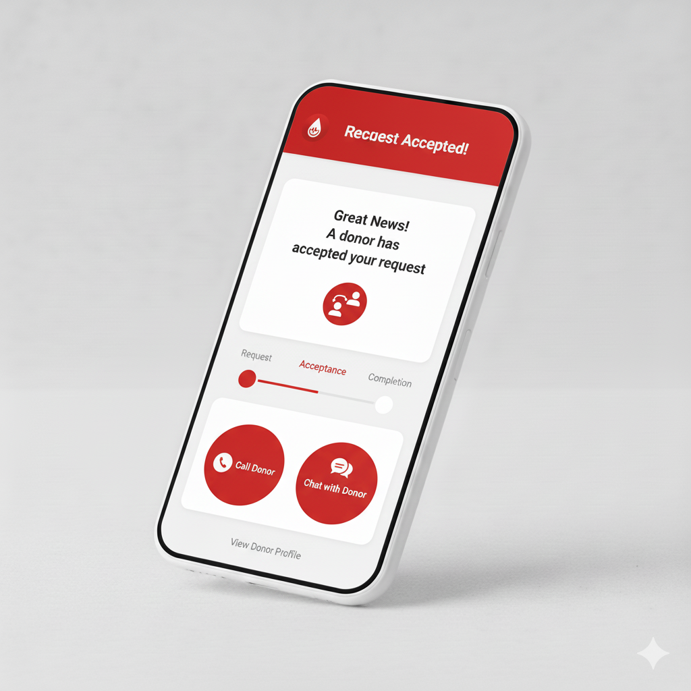
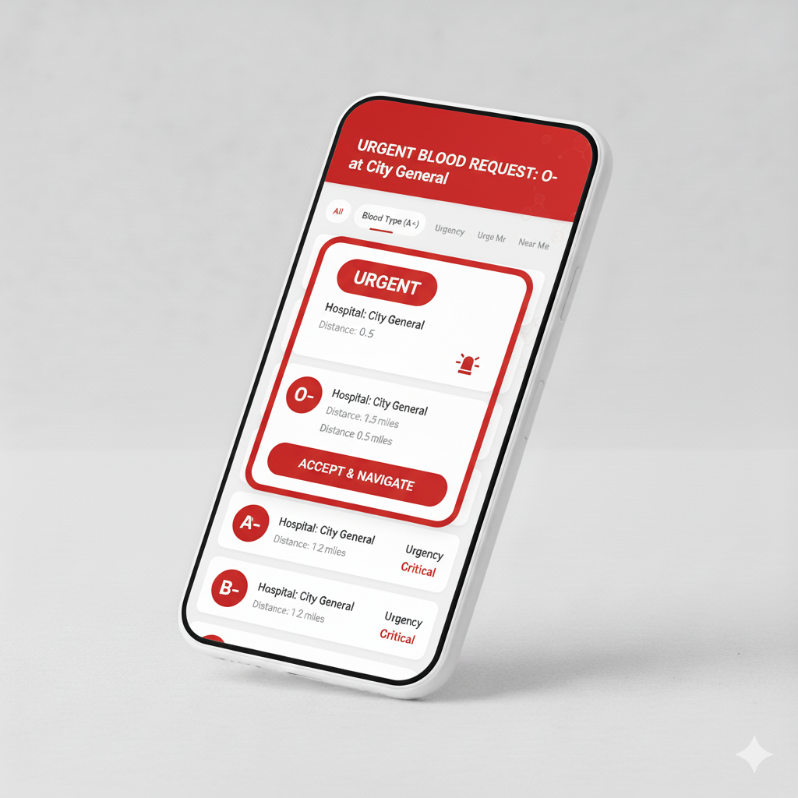
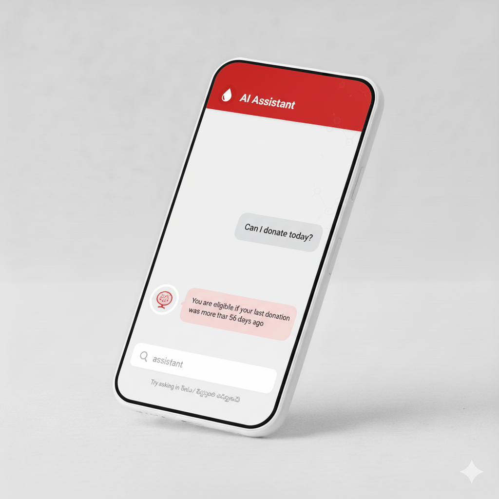
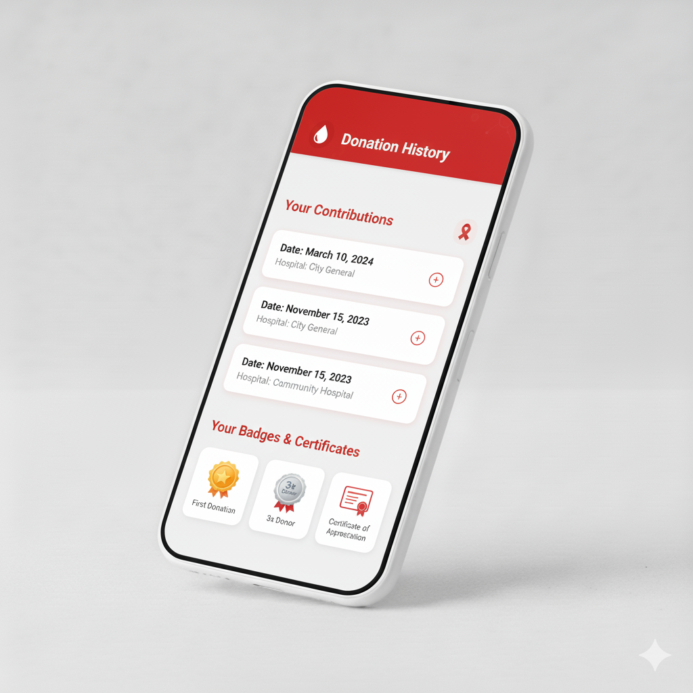

# 🩸 DonorSync – Smart Blood Donation App  

DonorSync is a mobile application designed to connect **blood donors and recipients** in real time.  
The app solves the challenges of delays, inefficiency, and trust in traditional blood donation systems by offering **role-based access**, **real-time donor matching**, and **AI-powered assistance**.  

---

## 🖼️ Prototype Screenshots  

Below are key screens from the DonorSync app prototype.  

> 💡 Note: All prototype images were **created using AI (Google Gemini)** to visualize the app concept.  
> These images illustrate the user interface and app flow; the actual implementation is being developed using Flutter and Firebase.

### 1️⃣ Splash / Welcome Screen
Professional, clean design with logo and tagline.  

### 2️⃣ Login / Signup Screen
Login via Email/Phone/Google; select Donor or Recipient role.  

### 3️⃣ Donor Dashboard
Donors see nearby blood requests with filters and accept buttons.  

### 4️⃣ Recipient Request Form
Recipients can post blood requests with details like blood group, hospital, and urgency.  

### 5️⃣ Request Accepted / Confirmation
Shows donor acceptance and next steps (chat/call, progress tracking).  

### 6️⃣ Emergency Mode
Highlights urgent requests with badges and prioritization.  

### 7️⃣ AI Assistant Chat
Helps users with eligibility, FAQs, and structured request guidance.  

### 8️⃣ Donation History / Certificates
Tracks completed donations and awards badges or certificates to donors.  

---

## 🚀 Features  

- **Role-Based Access:** Donor, Recipient, Admin interfaces.  
- **Secure Authentication:** Firebase Auth + OTP verification.  
- **Real-Time Matching:** Blood type + location filter, push notifications.  
- **Verification & Trust:** ID/document upload, reputation badges.  
- **Multilingual Support:** Telugu-first UI, English support.  
- **Donation Tracking:** History, certificates, gamification.  
- **AI Assistance:** OpenAI-powered guidance and FAQs.  

---

## 📱 User Flow  

1. Recipient posts a blood request.  
2. System finds nearby matching donors.  
3. Donors receive notifications and accept requests.  
4. Secure contact established → donation completed.  
5. Donation logged, donor receives badge/certificate.  

---

## 📅 Development Roadmap  

- **Phase 1:** MVP – roles, auth, matching, notifications.  
- **Phase 2:** Verification, history, admin dashboard.  
- **Phase 3:** AI integration, multilingual UI.  
- **Phase 4:** Scaling – partnerships, gamification.  

---

## 👥 Contribution  

Contributions welcome: fork → feature branch → commit → push → pull request.  

---

## 📜 License  

MIT License – see [LICENSE](LICENSE) for details.  

---

## 💡 Vision  

Create a **trustworthy, accessible, and scalable blood donation platform** that saves lives by connecting donors and recipients efficiently and safely.
